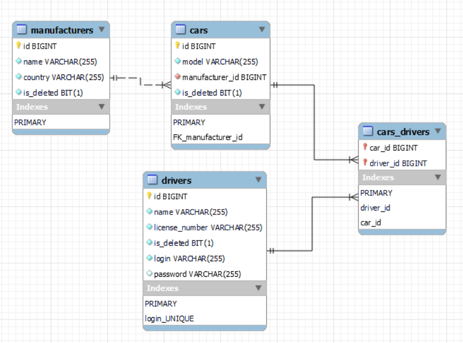

# Taxi service

### Overview
Here is simple project to learn basic operation for connections to Data Base and manipulation of data throw the web browser.

### Project description
In the project uses connection to DB by JDBC. Implementation of N-tier architecture. And uses of JavaServlet to launch project on web service.

Project has structure:

- Authentication form
- Display All Drivers
- Display All Cars
- Display All Manufacturers
- Create new Driver / Register new Driver
- Create new Car
- Create new Manufacturer
- Add Driver to Car
- Delete Driver from Car
- Delete Driver
- Delete Car
- Delete Manufacturer
- Display My Current Cars

### Project has 4-tier architecture

- Presentation layer (Shown on the web browser by .jsp pages)

- Controller layer (Representing of Servlets and Filter)
- Service layer
- Data access object layer

### Database structure

### Technologies used in project

- Java v.18
- Apache Tomcat v.9.0.64
- MySQL v.8.0
- Maven v.3.8.5
- Java Servlet v.4.0.1
- JSTL v.1.2
- JSP
- HTML, CSS

### To run project you should

1. Install MySQL, Apache Tomcat (v 9.0.64), Git, Maven, Java
2. Clone the project from GitHub
3. Configure Apache Tomcat and MySQL
4. Initialise database. Use for that src/main/resources/init_db.sql
5. Set URL, USERNAME, PASSWORD, JDBC_DRIVER in /util/ConnectionUtil class
6. Configure Tomcat library Application path in Edit configurations
7. Start Tomcat
8. Enter the browser and input the appropriate url 